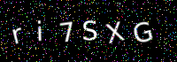

## 关于
这是生成captcha验证码图片的C++实现

## 为什么创建此项目?

有很多生成captcha验证码的其他语言库，但是我没有找到一个好用简单的C++实现，因为我的项目需要，
所以我创建了此项目。

## 依赖

1. (必须) https://github.com/GreycLab/CImg/blob/master/CImg.h.
2. (可选) imagemagick. 如果你需要png等常见格式，你需要安装这个库。

## 快速开始

在Ubuntu上，使用以下方式安装依赖

```shell
sudo apt-get install libopenjp2-7 --fix-missing
sudo apt-get install imagemagick --fix-missing
```

从 [CImg](https://github.com/GreycLab/CImg/blob/master/CImg.h) 下载 CImg.h.

C++代码示例:

```c++
#define cimg_display 0
#include "CImg.h"
#include <cstdlib>
#include <ctime>
#include <iostream>
#include <string>

using namespace cimg_library;

std::string generateRandomText(int length) {
  const std::string characters =
      "ABCDEFGHIJKLMNOPQRSTUVWXYZabcdefghijklmnopqrstuvwxyz0123456789";
  std::string randomText;
  for (int i = 0; i < length; ++i) {
    randomText += characters[rand() % characters.size()];
  }
  return randomText;
}

void generateCaptchaImage(const std::string &text,
                          const std::string &filename) {
  const int width = 200;
  const int height = 70;
  const float fixed_space = 10; // Adjust this value to control spacing between characters
  CImg<unsigned char> image(width, height, 1, 3, 0); // Create a black image
  const unsigned char white[] = {255, 255, 255};

  // Calculate character dimensions
  int totalChars = text.size();
  int charWidth = (width - totalChars * fixed_space) / totalChars;
  int charHeight = height / 2; // Assuming single line of text

  std::cout << "charWidth = " << charWidth << std::endl;
  std::cout << "charHeight = " << charHeight << std::endl;

  // Draw text with deformation
  int x = 10;
  int y = (height - charHeight) / 2; // Center vertically
  for (char c : text) {
    CImg<unsigned char> charImage(charWidth, charHeight, 1, 3, 0);
    charImage.draw_text(0, 0, std::string(1, c).c_str(), white, 0, 1,
                        charHeight);

    // Apply random transformations
    float angle = (rand() % 30) - 15; // Rotate between -15 and 15 degrees

    charImage.rotate(angle).resize(charImage.width(), charImage.height());

    // Ensure the character fits within the image boundaries
    if (x + charImage.width() > width) {
      std::cout << "x + charImage.width() = " << x + charImage.width()
                << std::endl;
      break; // Stop drawing if the text exceeds the image width
    }

    image.draw_image(x, y, charImage);
    x += charImage.width();
  }

  // Add some noise
  for (int i = 0; i < 1000; ++i) {
    int x = rand() % width;
    int y = rand() % height;
    unsigned char color[] = {(unsigned char)(rand() % 256),
                             (unsigned char)(rand() % 256),
                             (unsigned char)(rand() % 256)};
    image.draw_point(x, y, color);
  }

  // Save the image as PPM
  std::string tempFilename = "captcha.ppm";
  image.save(tempFilename.c_str());

  // Convert PPM to PNG using ImageMagick
  std::string command = "convert " + tempFilename + " " + filename;
  std::system(command.c_str());

  // Remove the temporary PPM file
  std::remove(tempFilename.c_str());
}

int main() {
  srand(time(0));
  std::string captchaText = generateRandomText(6);
  std::string filename = "captcha.png";
  generateCaptchaImage(captchaText, filename);
  std::cout << "CAPTCHA generated: " << captchaText << std::endl;
  std::cout << "Image saved as: " << filename << std::endl;
  return 0;
}
```

编译和运行

```shell
g++ c_image_test.cc -o c_image_test 

./c_image_test
```

查看生成的验证码图片



觉得有用的话，不妨给个Star
